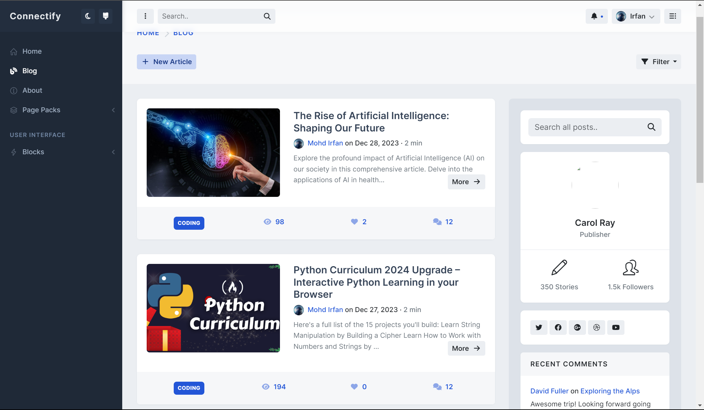
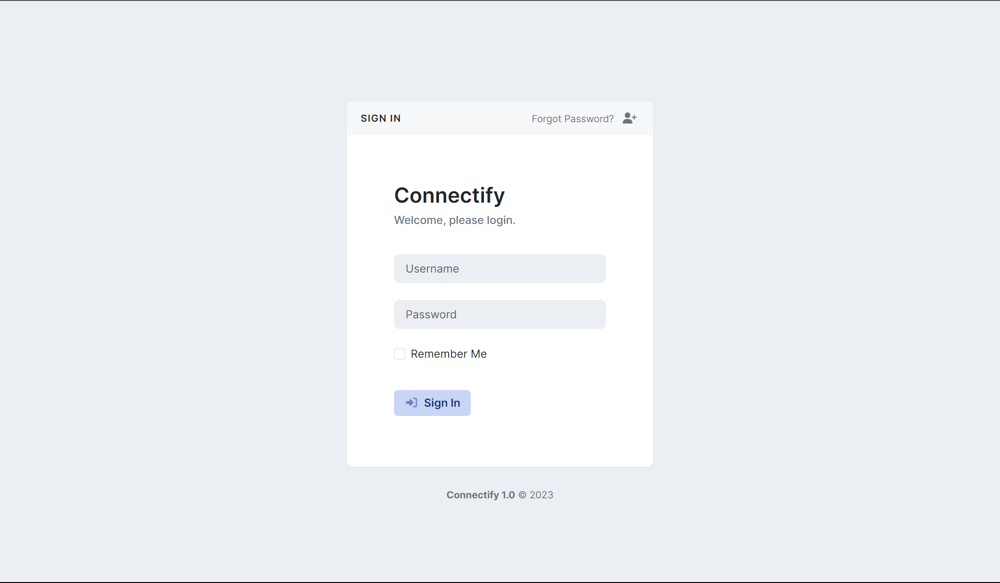
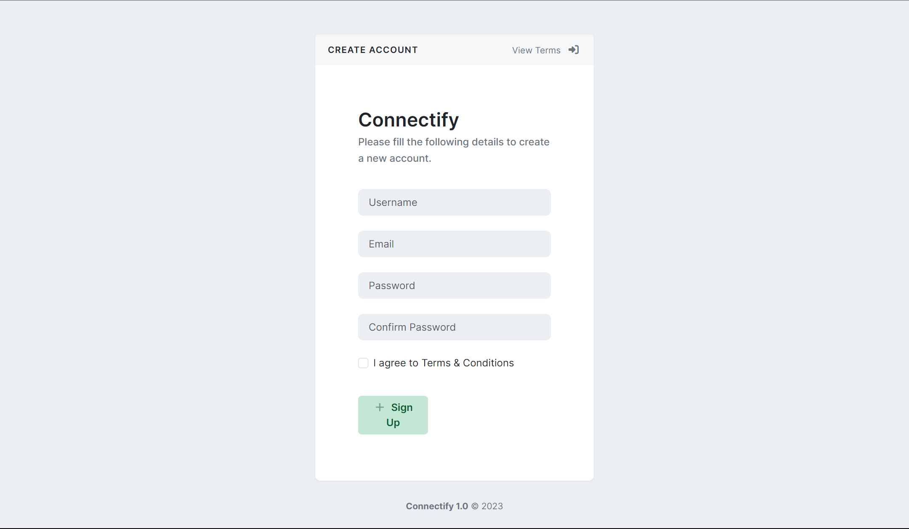
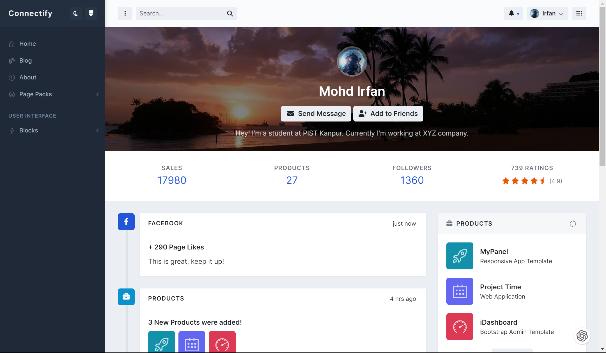

# Connectify

    <!-- <h1 align="center"></h1> -->
    

        
    

    

        A Social Media Platform for connecting people.
    

Connectify is a social media platform that allows users to connect with each other and share their thoughts and ideas. Users can create posts, like and comment on posts, and follow other users.

- [Brand Details](brand-info.md)

## Preview

| Login Page | Register Page |
| --- | --- |
|  |  |

| Blog Page | Post Page |
| --- | --- |
|  |  |

| Profile Page | Edit Profile Page |
| --- | --- |
|  |  |

| Settings Page | Change Password Page |
| --- | --- |
|  |  |

## Technologies Used

## Features

Design and implement the necessary models, views, and templates to create a social media platform that allows users to connect with each other and share their thoughts and ideas. Users should be able to create posts, like and comment on posts, and follow other users. Users should also be able to edit and update their profile information and change their passwords.

- Successfully implement the following features:
  - **User authentication:** Sign Up, Login, OAuth 2.0(Google, Github), Logout, Forgot Password. [[more details & bug](detailed-features.md)]
  - Posts Create, edit, and delete - (Markdown Editor), Thumbnail resizing.
    - Create: Title, Content, Description, Thumbnail, Tags, Category, Publish/Unpublish, Status: Save as Draft or Published.
    - Edit:
    - Delete:
  - Like and unlike posts
  - Comment and reply to comments on posts
  - Follow and unfollow other users
  - View all posts on the home page

1. Allow a user to sign up and log in to their account.
2. Public Profile view
3. Create, Edit, Delete Posts with customized text, pictures and links
4. Like, Comment / Reply, Save and Search posts
5. Follow and Un-follow users
6. Friend Request
7. Notifications

### Account App: 1. User Authentication

- Users can sign up and log in to their accounts.
- Users can reset their passwords.

**Bug Fixes:**

- 2 Tests are failing in this app.

For more details, see [User Authentication](user-authentication.md).

### Blog App: 1. Posts

- Users can create, edit, delete posts.
- Users can view all posts.

**Bug Fixes:**

- Image Cropping: The image cropping feature is not working properly. The image is not being cropped to the specified dimensions.
- I'have to write tests for this app.

### 2. User Profile

## How to Use

**Installation instructions:**

1. Create a virtual environment and activate it. [[reference](https://gist.github.com/dev-mdirfan/b5fba9cb7b4b6fb3d383c50f7e1e79cb)]
2. Install the required packages using **`pip install -r requirements.txt`**.

## How to Contribute

<i>Other places you can find us:</i> 

